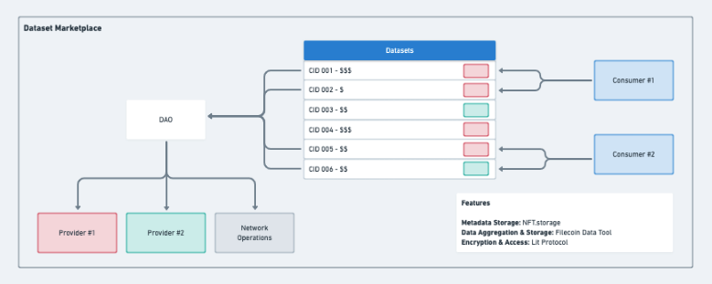

# Dataset Tokens Contract

## Project



### Purpose

The purpose of the dataset token is to tokenize datasets on Filecoin

### Users

- Data Providers: store encrypted data on Filecoin and grant access to user's who own a dataset token.
- Data Consumers: purchase dataset tokens on a marketplace to get access to the encrypted data stored on Filecoin.

## Getting Started

### Install Foundry

If you have not installed Foundry see the documentation [here](https://book.getfoundry.sh/getting-started/installation).

### Build

```
forge build
```

### Test

```
forge test
```

## Deployment

### Deploy and Verify Contract

Change directory to `contracts`:

```
cd contracts
```

Create `.env` file:

```
touch .env
```

Add Mumbai RPC URL, private key and Polygon Scan API Key to `.env`:

```
MUMBAI_RPC_URL=<INSERT_URL>
DEPLOY_PRIVATE_KEY=<INSERT_PRIVATE_KEY>
ETHERSCAN_API_KEY=<INSERT_API_KEY>
```

Load environment variables:

```
source .env
```

Run deployment script:

```
forge script script/DatasetTokens.s.sol \
--rpc-url $MUMBAI_RPC_URL \
--gas-estimate-multiplier=100 \
--slow --broadcast --legacy -vvvv
```

Notes:

- adjust `--gas-estimate-multiplier` in case of Gas Limit errors.
- `--legacy` if or EIP-1559 errors.

Verify the contract with Polyscan:

```
forge verify-contract \
--chain mumbai \
<INSERT_CONTRACT_ADDRESS> \
src/DatasetTokens.sol:DatasetTokens
```

Or, flatten the contract for manual contract verification:

```
forge flatten --output assets/artifacts/DatasetTokens.f.sol src/DatasetTokens.sol
```

### Deployments

#### Filecoin - Calibration Testnet

- `2023-06-15` | [Filfox Link](https://calibration.filfox.info/en/address/t410fmr5vtcaekfz2xueystizgookgd23v7u2qqn6hna) | [Commit](https://github.com/CannabisGenomeDAO/HackFS/commit/f961a4dbc742096730221150bf36d510673345f4)

#### Polygon - Mumbai Testnet

- `2023-06-17` | [Polyscan Link](https://mumbai.polygonscan.com/address/0x77f9cc01794280758c184e95924a3dd6707316e4) | [Commit](https://github.com/CannabisGenomeDAO/HackFS/commit/e1df594405b937d6c85337a45cbb3e080a0e748e)
